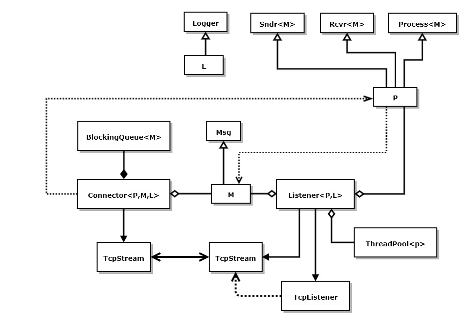
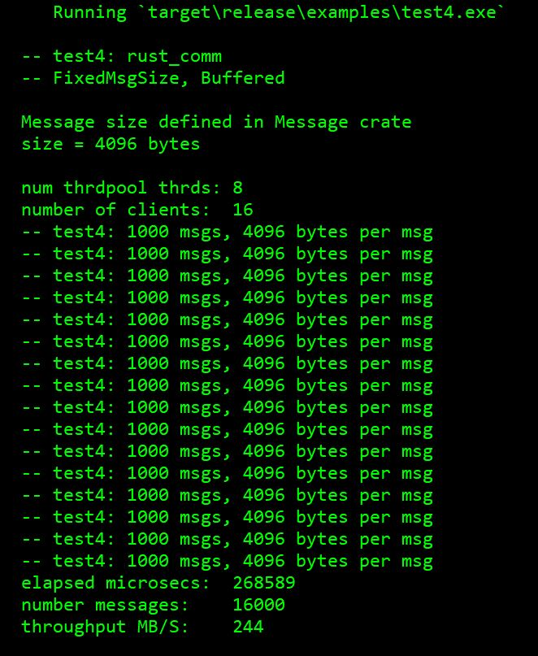
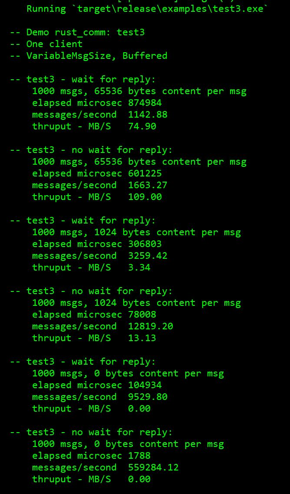

# RustCommExperiments Repository

**Message-passing communicator using TcpStream and TcpListener**

*Last Modified: 11/29/2022*

<!-- [RustCommExperiments code on GitHub](https://github.com/JimFawcett/RustCommExperiments) -->

## Quick Status

- **Code functions correctly**: No known defects
- **Demonstration code**: yes
- **Documentation**: yes
- **Test cases**: yes
- **Static library**: yes
- **Build requires**: Rust installation
- **Planned design changes**: Add support for file transfer

---

## Prologue

This repository contains three variations on a synchronous message-passing communication system. The system uses TcpStream and TcpListener types from the std::net library.

The variations are experiments to see how performance varies with different design strategies:

1. Fixed message size with buffered transfers
2. Variable message sizes with buffered transfers
3. Unbuffered transfers of messages with variable sizes

## Concept

<!--  -->

Figure 1. RustComm Concept 
 
RustComm is a facility for sending messages between a Sender and Receiver. It uses the std::net::TcpStream and std::net::TcpListener types.

This is a prototype for message-passing communication system. It provides three user defined types: `Connector`, `Listener`, and `Message`, with generic parameters `M`, `P`, and `L`, as shown in Fig. 1.

`M` implements the `Msg` trait and represents a message to be sent between endpoints. `P` implements the `Process<M>` trait that defines message processing, and `L` implements the `Logger` trait that supports logging events to the console that can be turned on or off by the types supplied for `L`, e.g., `VerboseLog` and `MuteLog`.

### The RustComm library:

- Uses queued full-duplex buffered message sending and receiving
- Each message has a header specifying either fixed or variable size content and `Vec<u8>` body.
- For each `Connector<P, M, L>` connection, `Listener<P, L>` processes messages until receiving a message with MessageType::END. `Listener<P, L>` spawns a thread for each client connection and processes messages in `P::process_message`.
- In this version, `P::process_message` echos back message with "reply" appended as reply to sender. You observe that behavior by running test1, e.g., `cargo run --example test1`.

The long-term goal for RustComm is to serve as a prototyping platform for various messaging and processing strategies. This version defines traits: `Sndr<M>`, `Rcvr<M>`, `Process<M>`, `Msg`, and `Logger`.

The user-defined types, `M` and `P`, are things that change as we change the message structure, defined by `M` and connector and listener processing defined by `P`. These types are defined in the rust_comm_processing crate.

The somewhat complex handling of TcpStreams and TcpListener are expected to remain fixed. They are defined in the crate rust_comm.

Finally, logger `L` provides a write method that will, using `VerboseLog` for `L`, write its argument to the console. `MuteLog` simply discards its argument.

The last step in this phase of development was to add a threadpool, as shown in Fig. 1. The threadpool exists and has been integrated into the Listener component. Fig 2. shows the results.

<!--  -->

*Figure 2. RustComm Output Test4*

<!--  -->

*Figure 3. RustComm Output Test3*

## Current Design

There are three user-defined types: Message, Connector, and Listener. Connector and Listener each use an existing component BlockingQueue<Message>

### Message

**Methods:**

1. **`new() -> Message`**  
   Create new `Message` with empty body and MessageType::TEXT.

2. **`set_type(&mut self, mt: u8)`**  
   Set `MessageType` member to one of: `TEXT, BYTES, END`.

3. **`get_type(&self) -> MessageType`**  
   Return `MessageType` member value.

4. **`set_body_bytes(&mut self, b: Vec<u8>)`**  
   Set `body_buffer` member to bytes from `b: Vec<u8>`.

5. **`set_body_str(&mut self, s: &str)`**  
   Set `body_buffer` member to bytes from `s: &str`.

6. **`get_body_size(&self) -> usize`**  
   Return size in bytes of body member.

7. **`get_body(&self) -> &Vec<u8>`**  
   Return `body_buffer` member.

8. **`get_body_str(&self) -> String`**  
   Return body contents as lossy `String`.

9. **`clear(&self)`**  
   Clear body contents.

---

Both `Connector<P, M, L>` and `Listener<P, L>` are parameterized with `L`, a type satisfying a `Logger` trait. The package defines two types that implement the trait, `VerboseLog` and `MuteLog` that allow users to easily turn on and off event display outputs. Fig 2. uses `MuteLog` in both `Connector<P, M, L>` and `Listener<P, L>`.

---

### Connector<P, M, L>

**Methods:**

1. **`new(addr: &'static str) -> std::io::Result<Connector<P,M,L>>`**  
   Create new `Connector<P,M,L>` with running send and receive threads.

2. **`is_connected(&self) -> bool`**  
   Is connected to `addr`?

3. **`post_message(&self, msg: M)`**  
   Enqueues msg to send to connected Receiver.

4. **`get_message(&mut self) -> M`**  
   Reads reply message if available, else blocks.

5. **`has_message(&self) -> bool`**  
   Returns true if reply message is available.

### Listener<P, L>

**Methods:**

1. **`new(nt: u8) -> Listener<P, L>`**  
   Create new `Listener<P, L>` with nt threads running.

2. **`start(&mut self, addr: &'static str) -> std::io::Result<JoinHandle<()>>`**  
   Bind `Listener<P,L>` to `addr` and start listening on dedicated thread.

## Operation

This is intended to be a simple test-bed for ideas - easy to use and with very little setup and configuration.

## Build

Download and, in a command prompt, `cargo build` or `cargo run`.

## Status

### Expected Changes and Additions:

- Add file transfer capability
- Add user-defined Comm type that composes a `Connector` and `Listener`.
